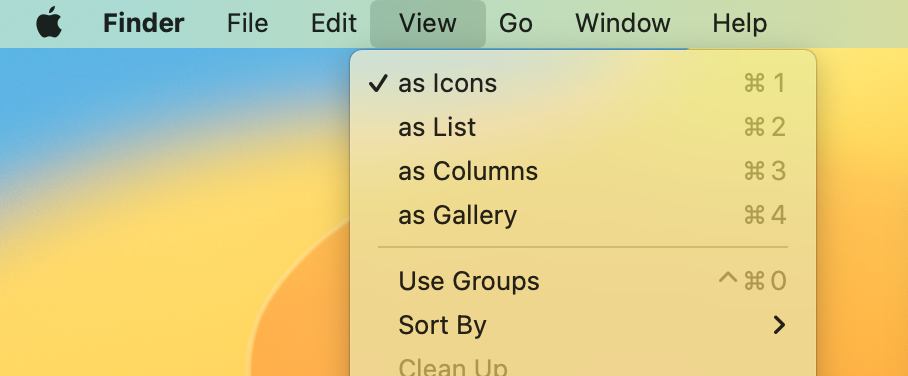
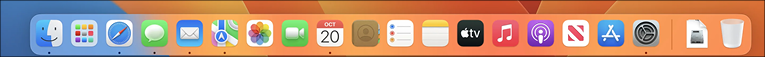
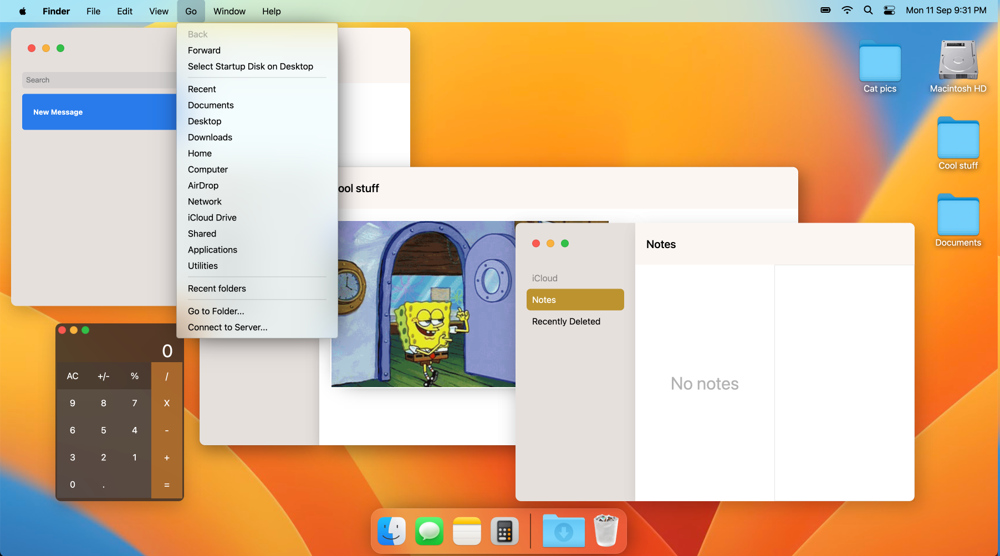
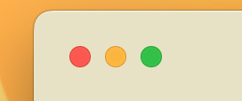

# FakeOS 
## A "fake" version of Mac OS Ventura made with HTML, SCSS and JavaScript

Click [this link](https://squigglevision.github.io/FakeOS/) to play around with a live version of the site.

### What the "real" Mac OS looks like:

This screenshot of the OS includes the Ventura wallpaper, an open menu and multiple in-built Mac applications which formed the basis for my replica:

On an external monitor, hovering on the menu fills in the bar completely, as shown below:

This is what the "Dock" looks like in Ventura:

The "Dock" is a menu that houses all of the open applications as well as regularly used applications, and is found at the bottom of the screen by default.

### What FakeOS looks like:

As you can see from the above screenshot, with FakeOS I've attempted to recreate the look and feel of the main desktop, menu and native Mac apps while adding some stylistic changes.

---

## Requirements / Purpose

The purpose of this project was to challenge me to recreate an existing design - in terms of layout, formating, images/design - in CSS, and to consolidate my knowledge of HTML, CSS and JavaScript.

For the project MVP, I had to:
- Add a wallpaper that scales to fit the viewport
- Have selectable icons that would open an "app" - a modal that displays text, an image or a form
- Position the menus in the appropriate places
- Use JavaScript modules to split up the code

---

## Build Steps

To run this application correctly on your local machine, you must use the Live Server extension with VS Code or a localhost address. 
Opening the index.html file will not allow the JS functions to work.

---

## Design Goals / Approach

My approach with this project was to replicate the look and feel of Mac OS Ventura. To do this, I closely observed what happened when I used Ventura on my computer, and worked out how to replicate that using the DOM and CSS.

When approaching my design, I:

-  Made sure the menu both looks and functions similarly to the real menu, by ensuring that dropdowns stay open until either the user clicks anywhere else or moves their mouse to an empty spot on the menu. Clicking on the menu item will also close it.
-  Made the apps on the "Dock" open when clicked, and designed it so that they will be brought to the front whenever their icon is clicked again, even if they're already open. The apps will then be able to be closed, by clicking on the red circle in the corner: 
- Changed the functionality of the "Finder" app so that there wouldn't be too many windows open on the screen at once. Clicking on the icons on the desktop will make the "Finder" window change its contents and header instead, which I thought would make for a more interesting effect.

---

## Features

This application has the following features:
-   A dynamic menu that replicates the look, feel and functionality of the menu in Mac OS Ventura
-   "Apps" that open when their icons are clicked, and are brought to the front when their icons are clicked again
-   Wallpaper and (open) apps that scale for various widescreen displays
-   Pictures of cats

---

## Future Goals

In the future, I would love to:
-  Make the apps have better functionality, rather than have static elements - such as making the calculator functional, and recreating the functionality of the messages and notes apps
-  Use more advanced DOM techniques. Instead of including the apps in the HTML and using event listeners to show and hide them, I want to add functions that programmatically generate the apps when clicked
-  Enable open apps to be pushed to the front when any part of the app is clicked, not just the icon in the dock

